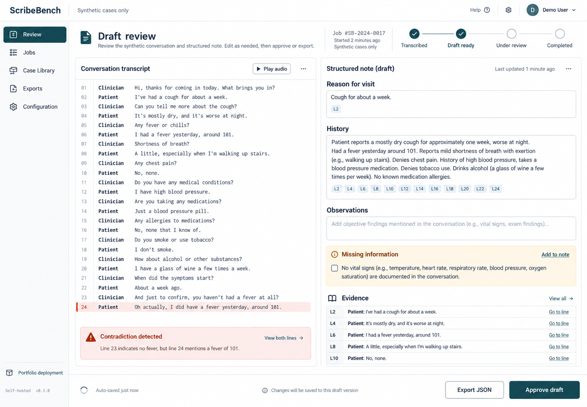

# ScribeBench

ScribeBench is a self-hosted portfolio deployment that turns **synthetic** clinician–patient transcripts into structured draft notes with line-level evidence, missing-information flags, editable review, explicit human approval, and JSON export.

It is an engineering demonstration—not a medical device, clinical validation, or record system. It must not receive real patient data and it does not diagnose or recommend treatment.



The image is a generated design reference. The implementation is code-native and its verified behavior is recorded in [validation evidence](docs/validation.md).

## What works now

Build-only pilot preparation is available in **Pilot & operations**: authorisation gates, per-participant
credentials, library-only synthetic inputs, usage/feedback records and service status. The pilot is
inactive by default. See [deployment, recovery, monitoring and pilot runbook](docs/pilot-operations.md).
No deployment, invitations or human pilot feedback are claimed. The review UI has been refined for
readable text, larger controls and responsive layouts using the original visual direction.

- Durable, idempotent FastAPI jobs stored in SQLite/WAL.
- Bounded queue, timeouts, retries, restart recovery, model versioning, and rollback-by-configuration.
- Real local Ollama inference (Qwen3 4B by default), selectable operator-owned model connections, and OpenAI-compatible APIs/gateways. The rule-based provider is only an explicit test baseline.
- Single-workspace key sign-in with expiring HttpOnly sessions, logout revocation, login throttling, cross-origin write protection, and fail-fast production configuration.
- Structured validation, evidence references, contradictions, missing-information flags, and instruction-in-transcript handling.
- React review interface with edits, approval gate, deletion, job states, and approved-only JSON export.
- Request IDs, Prometheus-format metrics, latency/token counters, and transcript-free application logs.
- Synthetic scenario-family splits, a repeatable baseline evaluator, LoRA training scaffold, recovery tests, and operating docs.

Local GPU inference has been exercised on this workstation; see [qualification evidence](api/artifacts/local-model-qualification.json). LoRA training, hosted APIs, Docker/GPU-container qualification, multi-user identity and clinical validation are **not claimed as run**. This is a hardened single-workspace application, not a certified clinical production system.

## Run locally

Prerequisites: Python 3.11+, [uv](https://docs.astral.sh/uv/), Node.js 22.12+, and Ollama. Local inference has no per-token API charge; hardware/electricity are your responsibility.

```bash
ollama pull qwen3:4b
# Start Ollama if its local service is not already running: ollama serve
```

```bash
cd api
uv sync --group dev
uv run fastapi dev main.py
```

In another terminal:

```bash
cd web
npm install
npm run dev
```

Open `http://localhost:5173`. Native defaults use Ollama on port 11434. Set `SCRIBE_API_KEY` in the API environment to enable the sign-in screen; do not put it in Vite variables. Environment files are not implicitly loaded by the native API command. For network deployment, use HTTPS, `SCRIBE_ENV=production`, and a random key of at least 32 characters. See [model connections and deployment](docs/models.md).

Docker frontend/API with host Ollama (Ollama must be reachable from Docker; do not expose its port publicly):

```bash
docker compose up --build
```

Open `http://localhost:4173`.

Optional vLLM container (unqualified here; explicitly configure its model and endpoint):

```bash
SCRIBE_MODEL_PROVIDER=openai-compatible SCRIBE_MODEL_NAME=Qwen/Qwen2.5-7B-Instruct SCRIBE_MODEL_BASE_URL=http://model:8000 docker compose --profile gpu up --build
```

## Verify

```bash
make test
make check
make eval
```

See [customer brief](docs/customer-brief.md), [architecture](docs/architecture.md), [model selection](docs/model-selection.md), [evaluation plan](docs/evaluation.md), and [runbook](docs/runbook.md).
