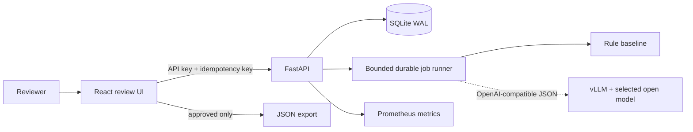
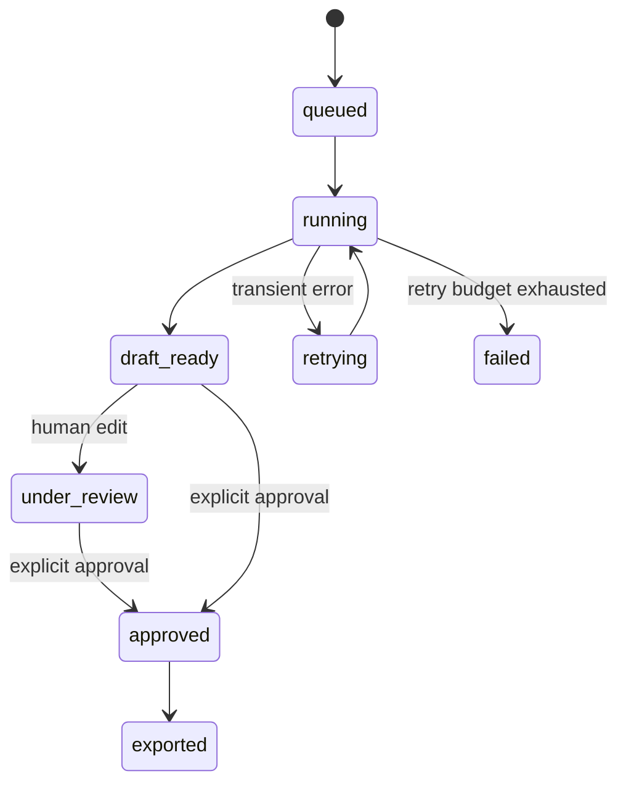

# Architecture

## Trust boundaries

- The browser holds synthetic content while a case is open. Browser storage is not used.
- The API stores synthetic transcripts and drafts in SQLite; database access is restricted to the service account.
- Logs intentionally receive request IDs, job IDs, status, counts, timings, and model versions only.
- Model requests stay inside the deployment network when vLLM is used.
- A single shared API key is suitable only for a portfolio deployment. Real multi-user use requires an identity provider, per-user authorisation, audit retention policy, and a privacy/security review.

## Job states

The database is authoritative. At startup, `queued`, `running`, and `retrying` jobs are re-queued. A unique idempotency key prevents duplicate submissions.

